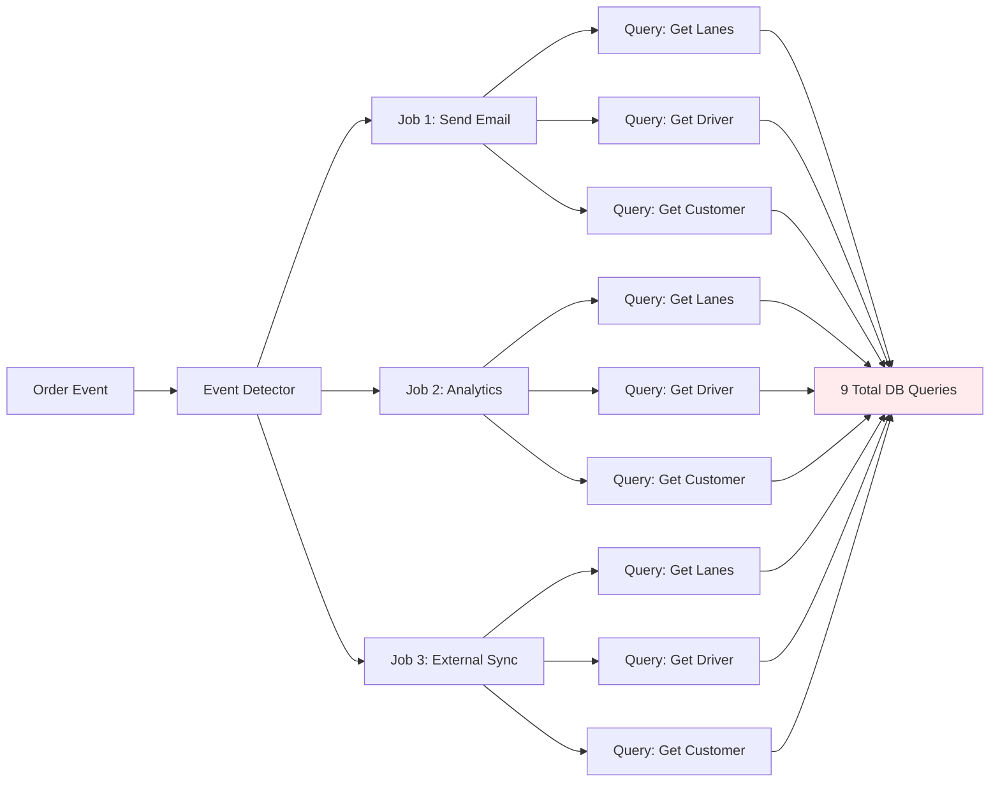
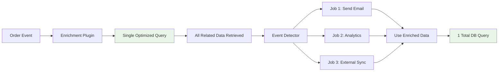
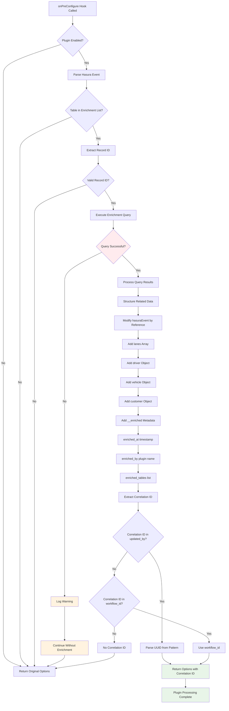
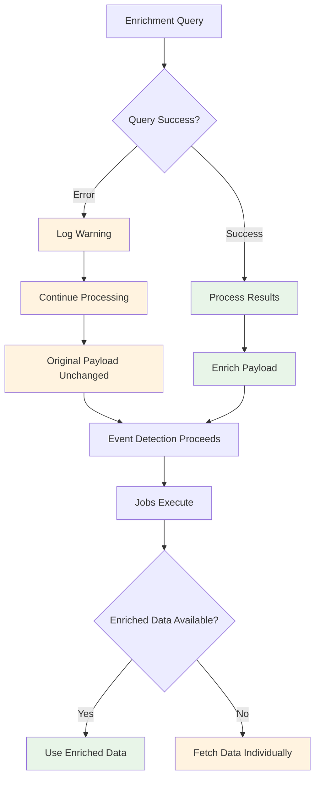

# Payload Enrichment Data Flow

This diagram illustrates how payload enrichment works in the plugin system to prevent N+1 database queries.

## Payload Enrichment Flow Diagram

```mermaid
flowchart TD
    A[Hasura Event Trigger] --> B[Raw Hasura Payload]
    B --> C{listenTo() Called}
    
    C --> D[Plugin Manager: onPreConfigure Hook]
    D --> E{Enrichment Plugin Registered?}
    
    E -->|No| F[Skip Enrichment]
    E -->|Yes| G[Check Table Name]
    
    G --> H{Table Needs Enrichment?}
    H -->|No| F
    H -->|Yes| I[Extract Record ID]
    
    I --> J{Record ID Found?}
    J -->|No| F
    J -->|Yes| K[Single Optimized DB Query]
    
    K --> L[Fetch Related Records]
    L --> M[Orders JOIN Lanes JOIN Drivers JOIN Vehicles JOIN Customers]
    
    M --> N[Related Data Retrieved]
    N --> O[Modify hasuraEvent by Reference]
    
    O --> P[Inject Related Records]
    P --> Q[hasuraEvent.event.data.new.lanes = relatedData.lanes]
    Q --> R[hasuraEvent.event.data.new.driver = relatedData.driver]
    R --> S[hasuraEvent.event.data.new.vehicle = relatedData.vehicle]
    S --> T[hasuraEvent.event.data.new.customer = relatedData.customer]
    
    T --> U[Add Enrichment Metadata]
    U --> V[hasuraEvent.event.data.new.__enriched]
    
    V --> W[Extract Correlation ID]
    W --> X{Correlation ID Found?}
    X -->|Yes| Y[Return options with correlationId]
    X -->|No| Z[Return original options]
    
    F --> Z
    Y --> AA[Enriched Payload + Correlation ID]
    Z --> BB[Original Payload + Options]
    
    AA --> CC[Event Detection Phase]
    BB --> CC
    
    CC --> DD[Event Detectors Run]
    DD --> EE{Event Detected?}
    
    EE -->|No| FF[No Jobs Execute]
    EE -->|Yes| GG[Jobs Execute with Enriched Data]
    
    GG --> HH[Job 1: Send Notification]
    GG --> II[Job 2: Update Analytics]  
    GG --> JJ[Job 3: Sync External System]
    
    HH --> KK[Access Enriched Data Directly]
    II --> KK
    JJ --> KK
    
    KK --> LL[No Additional DB Queries Needed]
    LL --> MM[All Related Data Already Present]
    
    MM --> NN[Job Results]
    NN --> OO[Final Response]

    classDef enrichment fill:#e1f5fe
    classDef database fill:#fff3e0
    classDef payload fill:#f3e5f5
    classDef jobs fill:#e8f5e8
    
    class K,L,M,N database
    class O,P,Q,R,S,T,U,V enrichment  
    class B,AA,BB payload
    class HH,II,JJ,KK,LL,MM jobs
```

## Before vs After Enrichment

### Without Enrichment (N+1 Problem)


### With Enrichment (Optimized)


## Enrichment Plugin Implementation Flow



## Database Query Optimization

The enrichment plugin uses a single optimized PostgreSQL query to fetch all related data:

```sql
-- Single query replaces multiple N+1 queries
SELECT 
    o.*,
    json_agg(DISTINCT jsonb_build_object(
        'id', l.id,
        'pickup_location', l.pickup_location,
        'delivery_location', l.delivery_location,
        'distance_miles', l.distance_miles,
        'status', l.status
    )) FILTER (WHERE l.id IS NOT NULL) as lanes,
    
    row_to_json(d.*) as driver,
    row_to_json(v.*) as vehicle,
    row_to_json(c.*) as customer
    
FROM orders o
LEFT JOIN lanes l ON l.order_id = o.id
LEFT JOIN drivers d ON d.id = o.driver_id
LEFT JOIN vehicles v ON v.id = o.vehicle_id  
LEFT JOIN customers c ON c.id = o.customer_id
WHERE o.id = $1
GROUP BY o.id, d.id, v.id, c.id;
```

## Performance Benefits

### Query Reduction
- **Before**: 1 + (N × M) queries where N = jobs, M = related tables
- **After**: 1 query total
- **Example**: 3 jobs × 3 related tables = 9 queries → 1 query (89% reduction)

### Memory Efficiency
- Related data loaded once and shared across all jobs
- No duplicate data fetching or caching needed

### Response Time
- Single database round-trip vs multiple sequential queries
- Reduced connection overhead and network latency

## Error Handling Flow



This graceful degradation ensures that enrichment failures don't break event processing - the system falls back to individual queries if needed.