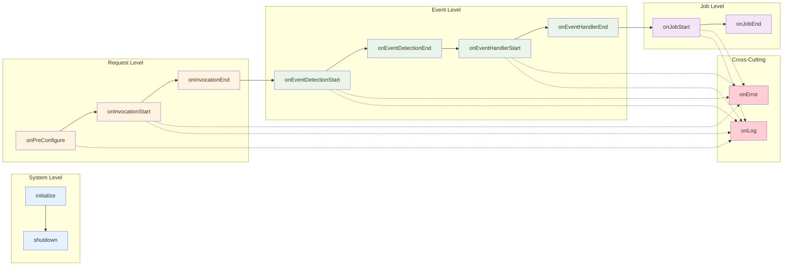
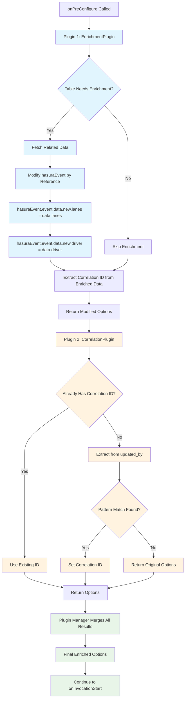

# Plugin Hook Execution Order

This diagram shows the precise order and timing of all 14 plugin hooks during event processing.

## Hook Execution Timeline

```mermaid
gantt
    title Plugin Hook Execution Timeline
    dateFormat X
    axisFormat %s

    section System Lifecycle
    initialize()                    :milestone, init, 0, 0
    shutdown()                      :milestone, shut, 100, 100

    section Pre-Processing
    onPreConfigure()                :crit, preconf, 10, 15
    onInvocationStart()             :invstart, 15, 20

    section Event Detection
    onEventDetectionStart()         :evtstart, 25, 27
    onEventDetectionEnd()           :evtend, 27, 30

    section Event Handling  
    onEventHandlerStart()           :handstart, 35, 37
    onJobStart()                    :jobstart, 40, 42
    onJobEnd()                      :jobend, 42, 45
    onEventHandlerEnd()             :handend, 45, 50

    section Post-Processing
    onInvocationEnd()               :invend, 55, 60

    section Throughout
    onLog()                         :log, 10, 60
    onError()                       :error, 10, 60
```



## Detailed Hook Flow Diagram

```mermaid
flowchart TD
    Start([System Start]) --> Init[1. initialize()]
    Init --> WaitForEvent[Wait for Hasura Event]
    
    WaitForEvent --> Event[Hasura Event Received]
    Event --> PreConf[2. onPreConfigure()]
    
    PreConf --> EnrichPayload{Enrich Payload?}
    EnrichPayload -->|Yes| ModifyPayload[Modify hasuraEvent by reference]
    EnrichPayload -->|No| ExtractCorr[Extract Correlation ID]
    ModifyPayload --> ExtractCorr
    
    ExtractCorr --> InvStart[3. onInvocationStart()]
    InvStart --> LoadEvents[Load Event Modules]
    LoadEvents --> EventLoop{More Events to Check?}
    
    EventLoop -->|Yes| EvtDetStart[4. onEventDetectionStart()]
    EvtDetStart --> RunDetector[Run Event Detector]
    RunDetector --> EvtDetEnd[5. onEventDetectionEnd()]
    
    EvtDetEnd --> Detected{Event Detected?}
    Detected -->|No| EventLoop
    Detected -->|Yes| HandStart[6. onEventHandlerStart()]
    
    HandStart --> JobLoop{More Jobs to Run?}
    JobLoop -->|Yes| JobStart[7. onJobStart()]
    JobStart --> ExecuteJob[Execute Job Function]
    ExecuteJob --> JobEnd[8. onJobEnd()]
    JobEnd --> JobLoop
    
    JobLoop -->|No| HandEnd[9. onEventHandlerEnd()]
    HandEnd --> EventLoop
    
    EventLoop -->|No| InvEnd[10. onInvocationEnd()]
    InvEnd --> WaitForEvent
    
    %% Error and Logging (can happen anywhere)
    RunDetector -.->|Error| Error[11. onError()]
    ExecuteJob -.->|Error| Error
    Error -.-> Continue[Continue Processing]
    
    PreConf -.->|Log Message| Log[12. onLog()]
    InvStart -.->|Log Message| Log
    JobStart -.->|Log Message| Log
    Log -.-> Continue
    
    %% Shutdown
    WaitForEvent --> ShutdownSignal{Shutdown Signal?}
    ShutdownSignal -->|Yes| Shutdown[13. shutdown()]
    ShutdownSignal -->|No| WaitForEvent
    Shutdown --> End([System End])
    
    classDef critical fill:#ffcdd2
    classDef important fill:#fff3e0
    classDef normal fill:#e8f5e8
    classDef lifecycle fill:#e3f2fd
    classDef async fill:#f3e5f5
    
    class PreConf critical
    class InvStart,InvEnd important
    class EvtDetStart,EvtDetEnd,HandStart,HandEnd,JobStart,JobEnd normal
    class Init,Shutdown lifecycle
    class Error,Log async
```

## Hook Categories and Purposes

```mermaid
mindmap
  root((Plugin Hooks))
    System Lifecycle
      initialize()
        One-time setup
        Load configuration
        Establish connections
      shutdown()
        Cleanup resources
        Close connections
        Save final state
    
    Configuration Phase
      onPreConfigure()
        **MOST CRITICAL**
        Enrich payload by reference
        Extract correlation IDs
        Modify options before processing
    
    Processing Lifecycle
      onInvocationStart()
        Track processing start
        Initialize per-request metrics
        Log request details
      onInvocationEnd()
        Track processing completion
        Send final metrics
        Cleanup per-request resources
    
    Event Detection
      onEventDetectionStart()
        Track detection attempts
        Log event names being checked
        Start detection timers
      onEventDetectionEnd()
        Track detection results
        Log success/failure
        Record detection metrics
    
    Event Handling
      onEventHandlerStart()
        Track handler execution start
        Log detected events
        Initialize handler metrics
      onEventHandlerEnd()
        Track handler completion
        Log job results summary
        Record handler metrics
    
    Job Execution  
      onJobStart()
        Track individual job start
        Log job details
        Start job timers
      onJobEnd()
        Track job completion
        Log job results
        Record job metrics
    
    Cross-Cutting
      onError()
        Handle all errors
        Send to error tracking
        Log error details
      onLog()
        Integrate with logging systems
        Filter/enhance log messages
        Send to external systems
```

## Hook Execution Context



## Critical Hook: onPreConfigure Deep Dive



## Hook Data Flow

| Hook | Input | Output | Side Effects |
|------|--------|---------|--------------|
| `initialize()` | - | void | Setup connections, load config |
| `onPreConfigure()` | hasuraEvent, options | Modified options | **Modify hasuraEvent by reference** |
| `onInvocationStart()` | hasuraEvent, options, context, correlationId | void | Start metrics, logging |
| `onEventDetectionStart()` | eventName, hasuraEvent, correlationId | void | Log detection start |
| `onEventDetectionEnd()` | eventName, detected, hasuraEvent, correlationId | void | Log detection result |
| `onEventHandlerStart()` | eventName, hasuraEvent, correlationId | void | Log handler start |
| `onJobStart()` | jobName, jobOptions, eventName, hasuraEvent, correlationId | void | Start job timer |
| `onJobEnd()` | jobName, result, eventName, hasuraEvent, correlationId | void | Log job result, send metrics |
| `onEventHandlerEnd()` | eventName, jobResults, hasuraEvent, correlationId | void | Log handler completion |
| `onInvocationEnd()` | hasuraEvent, result, correlationId | void | Send final metrics |
| `onError()` | error, context, correlationId | void | Send to error tracking |
| `onLog()` | level, message, data, jobName, correlationId | void | Send to logging system |
| `shutdown()` | - | void | Cleanup resources |

## Execution Timing Examples

### Single Event, Single Job
```
initialize() [one time]
  ↓
onPreConfigure() [5-10ms - includes DB query for enrichment]  
  ↓
onInvocationStart() [1ms]
  ↓  
onEventDetectionStart() [<1ms]
  ↓
onEventDetectionEnd() [<1ms]  
  ↓
onEventHandlerStart() [<1ms]
  ↓
onJobStart() [<1ms]
  ↓
onJobEnd() [<1ms]
  ↓
onEventHandlerEnd() [<1ms]
  ↓
onInvocationEnd() [1-2ms]
```

### Multiple Events, Multiple Jobs per Event
```
onPreConfigure() [once per request]
onInvocationStart() [once per request]
  ↓
onEventDetectionStart() [event 1]
onEventDetectionEnd() [event 1]
onEventHandlerStart() [event 1]
  onJobStart() [job 1]
  onJobEnd() [job 1]
  onJobStart() [job 2] 
  onJobEnd() [job 2]
onEventHandlerEnd() [event 1]
  ↓
onEventDetectionStart() [event 2]
onEventDetectionEnd() [event 2] 
onEventHandlerStart() [event 2]
  onJobStart() [job 1]
  onJobEnd() [job 1]
onEventHandlerEnd() [event 2]
  ↓
onInvocationEnd() [once per request]
```