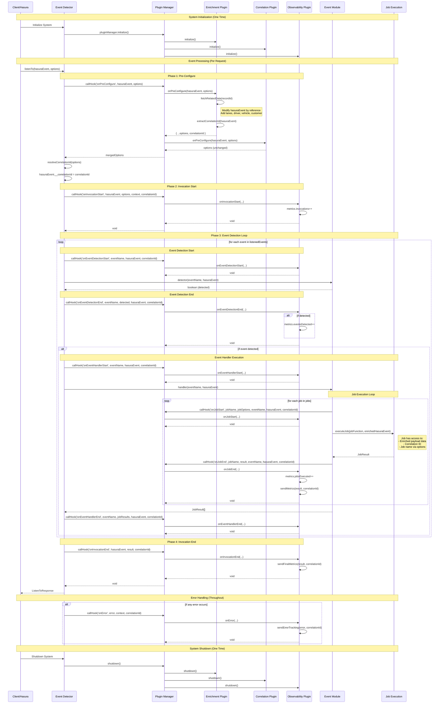

# Plugin System Sequence Diagram

This diagram shows the complete lifecycle of plugin hook execution during event processing.

## Key Sequence Points

### 1. **Initialization Phase** (One Time)
- Plugin manager initializes all registered plugins
- Each plugin sets up connections, loads configuration

### 2. **Pre-Configure Phase** (Critical for Data Flow)
- **Enrichment Plugin**: Modifies `hasuraEvent` by reference, adds related data
- **Correlation Plugin**: Extracts correlation ID from payload or enriched data
- **Result**: Enhanced payload + correlation ID available for all subsequent processing

### 3. **Event Detection Phase**
- System detects which business events occurred
- Plugins track detection metrics and performance

### 4. **Job Execution Phase**  
- Jobs execute with access to:
  - Enriched payload data (from enrichment plugin)
  - Correlation ID (from correlation plugin)
  - Job metadata (name, options)
- Plugins track job performance and results

### 5. **Error Handling** (Throughout)
- Any errors trigger `onError` hooks across all plugins
- Enables centralized error tracking and reporting

## Data Flow Highlights

1. **Payload Enrichment**: Raw Hasura payload → Enriched with related records → Available to all jobs
2. **Correlation ID**: Extracted from payload → Set in options → Available throughout pipeline  
3. **Observability**: Metrics collected at each phase → Sent to external systems
4. **Error Propagation**: Errors caught at any level → Sent to tracking systems with correlation ID