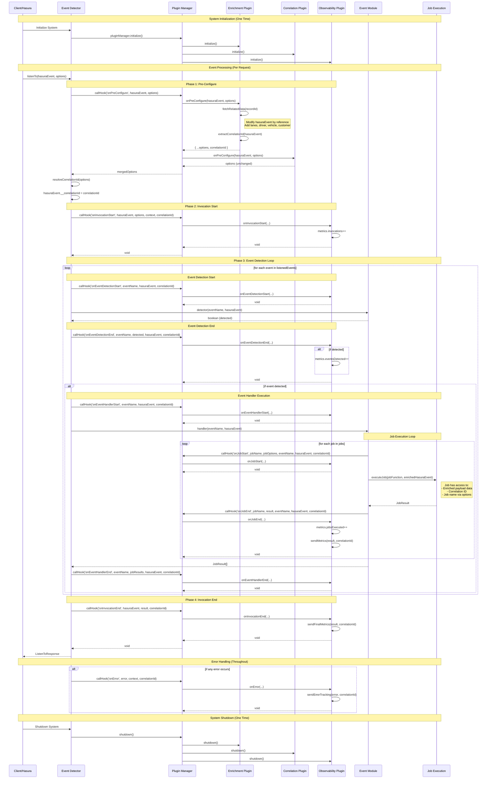

# Example Plugins

This directory contains example plugins that demonstrate how to extend the Hasura Event Detector with custom functionality. Each plugin showcases different aspects of the plugin architecture and provides real-world use cases.

## Plugin System Architecture

The Hasura Event Detector includes a powerful plugin system that allows you to extend and customize behavior at various points in the event processing lifecycle. Plugins are TypeScript/JavaScript classes that implement the `BasePlugin` interface and provide hooks that are called at specific points during event processing.

### Core Capabilities

Plugins enable:
- **Observability**: Log events, track metrics, send to external systems
- **Correlation ID Extraction**: Extract correlation IDs from payloads before processing
- **Payload Enrichment**: Modify and enrich event payloads to prevent N+1 queries
- **Options Modification**: Modify configuration before event processing begins
- **Error Handling**: Custom error handling and reporting
- **Lifecycle Monitoring**: Track job execution, event detection, and performance

### Plugin Hook Execution Order

1. **System Startup**
   - `initialize()` - called once per plugin

2. **Per Invocation**
   - `onPreConfigure()` - modify options and enrich payloads (including correlation ID extraction)
   - `onInvocationStart()` - processing begins

3. **Per Event**
   - `onEventDetectionStart()` - before checking event
   - `onEventDetectionEnd()` - after checking event
   - `onEventHandlerStart()` - before running jobs (if event detected)
   - `onJobStart()` - before each job
   - `onJobEnd()` - after each job
   - `onEventHandlerEnd()` - after all jobs complete

4. **End Processing**
   - `onInvocationEnd()` - processing complete

5. **Throughout**
   - `onLog()` - for log messages
   - `onError()` - when errors occur

6. **System Shutdown**
   - `shutdown()` - cleanup

## Available Example Plugins

### 🔍 [Observability Plugin](./observability/)
**Purpose**: Comprehensive monitoring and debugging for your event detector system.

**Features**:
- Complete execution tracking (invocations, events, jobs)
- Correlation ID tracing through entire event chains
- Performance monitoring and metrics
- Error debugging with stack traces
- Database persistence for historical analysis
- Visual dashboard integration

**Use Cases**: Production monitoring, performance optimization, debugging, audit trails

---

### 📋 [Console Interceptor Plugin](./console-interceptor/)
**Purpose**: Captures all console logs during job execution for comprehensive logging.

**Features**:
- Universal log capture from any source
- Job context awareness
- Configurable log levels
- Plugin system integration

**Use Cases**: Debug visibility, log centralization, third-party library logging

---

### 📝 [Simple Logging Plugin](./simple-logging/)
**Purpose**: Enhanced console logging with structured formatting and context.

**Features**:
- Multiple output formats (simple, structured, JSON)
- Colorized output with log levels
- Correlation ID tracking
- Job context inclusion
- Performance optimized

**Use Cases**: Development logging, structured output, log aggregation preparation

---

### 🔗 [Correlation ID Extraction Plugin](./correlation-id-extraction/)
**Purpose**: Extracts correlation IDs from various sources in Hasura event payloads.

**Features**:
- Multiple extraction strategies
- Pattern matching with regex
- Session variable support
- Metadata parsing
- Custom field extraction

**Use Cases**: Distributed tracing, request correlation, audit logging, debug assistance

---

### 👤 [Updated By Correlation Plugin](./updated-by-correlation/)
**Purpose**: Specialized extraction of correlation IDs from `updated_by` database fields.

**Features**:
- Pattern-based extraction from `updated_by` fields
- UUID format validation
- Operation filtering (UPDATE only)
- Flexible format support

**Use Cases**: User action tracking, API request correlation, workflow tracing

---

### 📦 [Order Enrichment Plugin](./order-enrichment/)
**Purpose**: Enriches event payloads with related database records to prevent N+1 queries.

**Features**:
- Automatic foreign key relationship following
- Reverse relationship fetching
- Built-in caching for performance
- Configurable record limits
- Custom enrichment queries

**Use Cases**: Performance optimization, reducing database queries, providing complete context

## Getting Started

### 1. Basic Plugin Usage

```typescript
import { pluginManager } from '@/plugins/plugin-system.js';
import { SimpleLoggingPlugin } from './example-plugins/simple-logging/plugin.js';

// Create and configure plugin
const logger = new SimpleLoggingPlugin({
  format: 'structured',
  colorize: true
});

// Register with plugin manager
pluginManager.register(logger);

// Initialize (usually done once at startup)
await pluginManager.initialize();

// Now use the event detector as normal - plugins will automatically hook in
await listenTo(hasuraEvent, options);
```

### 2. Multiple Plugin Usage

```typescript
import { pluginManager } from '@/plugins/plugin-system.js';
import { SimpleLoggingPlugin } from './example-plugins/simple-logging/plugin.js';
import { ConsoleInterceptorPlugin } from './example-plugins/console-interceptor/plugin.js';
import { CorrelationIdExtractionPlugin } from './example-plugins/correlation-id-extraction/plugin.js';

// Create plugins
const consoleInterceptor = new ConsoleInterceptorPlugin();
const logger = new SimpleLoggingPlugin({ format: 'json' });
const correlationExtractor = new CorrelationIdExtractionPlugin({
  extractFromSession: true
});

// Register all plugins
pluginManager.register(consoleInterceptor);
pluginManager.register(logger);
pluginManager.register(correlationExtractor);

await pluginManager.initialize();
```

### 3. Production Monitoring Setup

```typescript
import { ObservabilityPlugin } from './example-plugins/observability/plugin.js';
import { SimpleLoggingPlugin } from './example-plugins/simple-logging/plugin.js';
import { ConsoleInterceptorPlugin } from './example-plugins/console-interceptor/plugin.js';

// Production-ready monitoring stack
const observability = new ObservabilityPlugin({
  enabled: process.env.NODE_ENV === 'production',
  database: {
    connectionString: process.env.OBSERVABILITY_DB_URL
  },
  captureErrorStacks: true,
  captureHasuraPayload: false // Don't store sensitive data
});

const logger = new SimpleLoggingPlugin({
  format: 'json',
  logLevel: 'info',
  colorize: false
});

const consoleInterceptor = new ConsoleInterceptorPlugin({
  levels: ['error', 'warn'] // Only capture important logs in production
});

pluginManager.register(observability);
pluginManager.register(logger);
pluginManager.register(consoleInterceptor);

await pluginManager.initialize();
```

## Creating Custom Plugins

### 1. Basic Plugin Structure

```typescript
import { BasePlugin } from '@/plugins/plugin-system.js';
import type { PluginConfig, HasuraEventPayload, ListenToOptions } from '@/types/index.js';

interface MyPluginConfig extends PluginConfig {
  customOption: string;
}

export class MyPlugin extends BasePlugin<MyPluginConfig> {
  constructor(config: Partial<MyPluginConfig> = {}) {
    const defaultConfig: MyPluginConfig = {
      enabled: true,
      customOption: 'default-value',
      ...config
    };
    super(defaultConfig);
  }

  // Override lifecycle hooks you need
  override async onInvocationStart(hasuraEvent, options, context, correlationId) {
    // Your custom logic here
    console.log('Invocation started with correlation ID:', correlationId);
  }

  override async onEventDetectionStart(eventName, hasuraEvent, correlationId) {
    // React to event detection start
    console.log('Detecting event:', eventName);
  }

  // ... implement other hooks as needed
}
```

### 2. Powerful `onPreConfigure` Hook

The `onPreConfigure` hook is called **before** any event processing begins and is perfect for:

1. **Payload Enrichment** - Modify the Hasura payload by reference to add related data
2. **Correlation ID Extraction** - Extract correlation IDs and set them in options

#### Correlation ID Extraction Example

```typescript
override async onPreConfigure(
  hasuraEvent: HasuraEventPayload,
  options: Partial<ListenToOptions>
): Promise<Partial<ListenToOptions>> {
  // Extract correlation ID from updated_by field
  const parsedEvent = parseHasuraEvent(hasuraEvent);
  const updatedBy = parsedEvent.dbEvent?.new?.updated_by;

  if (updatedBy && typeof updatedBy === 'string') {
    const match = updatedBy.match(/^user\\.([0-9a-f-]{36})$/i);
    if (match) {
      console.log(`Extracted correlation ID: ${match[1]}`);
      return {
        ...options,
        correlationId: match[1] // Set correlation ID before processing
      };
    }
  }

  return options;
}
```

#### Payload Enrichment Example

```typescript
override async onPreConfigure(
  hasuraEvent: HasuraEventPayload,
  options: Partial<ListenToOptions>
): Promise<Partial<ListenToOptions>> {
  // 1. ENRICH PAYLOAD FIRST - Modify hasuraEvent directly (by reference)
  if (hasuraEvent.table.name === 'orders' && hasuraEvent.event.op === 'UPDATE') {
    await this.enrichOrderWithRelatedData(hasuraEvent);
  }

  // 2. THEN CONFIGURE OPTIONS - Extract correlation ID from enriched data
  const correlationId = this.extractCorrelationId(hasuraEvent);

  return correlationId ? { ...options, correlationId } : options;
}

private async enrichOrderWithRelatedData(hasuraEvent: HasuraEventPayload) {
  const orderId = hasuraEvent.event.data.new?.id;
  if (!orderId) return;

  // Fetch all related data in one optimized database query
  const relatedData = await this.fetchOrderRelatedData(orderId);

  // Modify the payload directly - all event detectors and jobs will see this enriched data
  hasuraEvent.event.data.new = {
    ...hasuraEvent.event.data.new,
    // Inject related records to prevent N+1 queries later
    lanes: relatedData.lanes,           // Child lanes for this order
    driver: relatedData.driver,         // Assigned driver details
    vehicle: relatedData.vehicle,       // Vehicle information
    customer: relatedData.customer,     // Customer details
    _enriched: {
      enriched_at: new Date().toISOString(),
      enriched_by: this.name
    }
  };

  console.log(`✅ Enriched order ${orderId} with ${relatedData.lanes.length} lanes and related data`);
}
```

### 3. Plugin with State Management

```typescript
export class MetricsPlugin extends BasePlugin<MyPluginConfig> {
  private metrics = new Map();

  override async onInvocationStart(hasuraEvent, options, context, correlationId) {
    // Track metrics
    const key = `${hasuraEvent.table.name}:${hasuraEvent.event.op}`;
    this.metrics.set(key, (this.metrics.get(key) || 0) + 1);
  }

  override async onInvocationEnd(hasuraEvent, result, correlationId) {
    // Log metrics
    console.log('Current metrics:', Object.fromEntries(this.metrics));
  }

  override async shutdown() {
    // Clean up state
    this.metrics.clear();
  }
}
```

## Available Plugin Hooks

| Hook | Parameters | Purpose |
|------|------------|---------|
| `initialize()` | none | Plugin initialization |
| `onPreConfigure(hasuraEvent, options)` | event, options | **Most powerful**: Modify payload and extract correlation IDs |
| `onInvocationStart(hasuraEvent, options, context, correlationId)` | event, options, context, id | React to processing start |
| `onEventDetectionStart(eventName, hasuraEvent, correlationId)` | name, event, id | React to event detection start |
| `onEventDetectionEnd(eventName, detected, hasuraEvent, correlationId, duration)` | name, detected, event, id, time | React to event detection end |
| `onEventHandlerStart(eventName, hasuraEvent, correlationId)` | name, event, id | React to job execution start |
| `onEventHandlerEnd(eventName, results, hasuraEvent, correlationId)` | name, results, event, id | React to job execution end |
| `onJobStart(jobName, jobOptions, eventName, hasuraEvent, correlationId)` | job, options, event, id | React to individual job start |
| `onJobEnd(jobName, result, eventName, hasuraEvent, correlationId, duration)` | job, result, event, id, time | React to individual job end |
| `onLog(level, message, data, jobName, correlationId)` | level, message, data, job, id | Handle log messages |
| `onError(error, context, correlationId)` | error, context, id | Handle errors |
| `onInvocationEnd(hasuraEvent, result, correlationId)` | event, result, id | React to processing end |
| `shutdown()` | none | Cleanup resources |

## Plugin Development Best Practices

### 1. Keep Plugins Focused
Each plugin should have a single responsibility (observability, correlation ID extraction, payload enrichment, error handling, etc.).

### 2. Handle Errors Gracefully
Plugin errors shouldn't break event processing:

```typescript
override async onJobEnd(jobName, result) {
  try {
    await sendMetrics(result);
  } catch (error) {
    console.warn('Failed to send metrics:', error);
    // Don't throw - let processing continue
  }
}
```

### 3. Use Correlation IDs
Always include correlation IDs in external calls for traceability:

```typescript
override async onInvocationEnd(hasuraEvent, result, correlationId) {
  await sendToAnalytics({
    ...analyticsData,
    correlationId // Include for tracing
  });
}
```

### 4. Implement Configuration
Make plugins configurable with TypeScript interfaces:

```typescript
interface MyPluginConfig extends PluginConfig {
  apiUrl?: string;
  timeout?: number;
  retries?: number;
}
```

### 5. Payload Enrichment Best Practices
When enriching payloads in `onPreConfigure`:

```typescript
override async onPreConfigure(hasuraEvent, options) {
  // 1. Check if enrichment is needed first
  if (!this.shouldEnrich(hasuraEvent.table?.name)) {
    return options;
  }

  // 2. Enrich payload by reference BEFORE extracting correlation ID
  try {
    await this.enrichPayload(hasuraEvent);
  } catch (error) {
    console.warn('Enrichment failed, continuing without it:', error);
    // Don't throw - let processing continue
  }

  // 3. Extract correlation ID from enriched data
  const correlationId = this.extractCorrelationId(hasuraEvent);

  return correlationId ? { ...options, correlationId } : options;
}
```

### 6. Clean Up Resources
Always implement `shutdown()` for proper cleanup:

```typescript
override async shutdown() {
  if (this.connection) {
    await this.connection.close();
  }
}
```

## Real-World Plugin Examples

### Order Enrichment Plugin (Performance Optimization)

```typescript
export class OrderEnrichmentPlugin extends BasePlugin {
  override async onPreConfigure(hasuraEvent, options) {
    const tableName = hasuraEvent.table?.name;

    // Only enrich order-related tables
    if (!['orders', 'shipments', 'bookings'].includes(tableName)) {
      return options;
    }

    const recordId = hasuraEvent.event.data.new?.id;
    if (!recordId) return options;

    try {
      // Single database query joining multiple tables
      const relatedData = await this.fetchOrderRelatedData(recordId);

      // Modify the payload directly by reference
      // All event detectors and jobs will see this enriched data
      hasuraEvent.event.data.new = {
        ...hasuraEvent.event.data.new,
        // Inject related records to prevent N+1 queries later
        lanes: relatedData.lanes,
        driver: relatedData.driver,
        vehicle: relatedData.vehicle,
        customer: relatedData.customer,
        _enriched: {
          enriched_at: new Date().toISOString(),
          enriched_by: this.name
        }
      };

      console.log(`✅ Enriched order ${recordId} with ${relatedData.lanes.length} lanes`);

      // Extract correlation ID from enriched data
      const correlationId = this.extractCorrelationId(hasuraEvent);

      return correlationId ? { ...options, correlationId } : options;

    } catch (error) {
      console.warn('Failed to enrich payload:', error);
      return options; // Continue processing even if enrichment fails
    }
  }
}
```

### Error Tracking Plugin

```typescript
export class ErrorTrackingPlugin extends BasePlugin {
  override async onError(error, context, correlationId) {
    await sendToSentry({
      error,
      context,
      correlationId,
      timestamp: new Date().toISOString()
    });
  }

  override async onJobEnd(jobName, result, eventName, hasuraEvent, correlationId) {
    if (!result.completed && result.error) {
      await sendToSentry({
        error: result.error,
        context: `job_failure_${jobName}`,
        correlationId,
        eventName,
        jobName
      });
    }
  }
}
```

### Correlation ID Extraction Plugin

```typescript
export class UpdatedByCorrelationPlugin extends BasePlugin {
  override async onPreConfigure(hasuraEvent, options) {
    const parsedEvent = parseHasuraEvent(hasuraEvent);
    const updatedBy = parsedEvent.dbEvent?.new?.updated_by;

    if (updatedBy && typeof updatedBy === 'string') {
      // Extract UUID from "prefix.uuid" format
      const match = updatedBy.match(/^.+\\.([0-9a-f-]{36})$/i);
      if (match) {
        return {
          ...options,
          correlationId: match[1]
        };
      }
    }

    return options;
  }
}
```

## Plugin Development Tips

### TypeScript Support
Plugins have full TypeScript support with proper type checking:

```typescript
import { BasePlugin } from '@/plugins/plugin-system.js';
import type {
  PluginConfig,
  HasuraEventPayload,
  CorrelationId,
  JobResult,
  ListenToOptions
} from '@/types/index.js';
```

### Testing Plugins
Create unit tests for plugin hooks:

```typescript
describe('MyPlugin', () => {
  let plugin: MyPlugin;

  beforeEach(() => {
    plugin = new MyPlugin();
  });

  test('onPreConfigure extracts correlation ID', async () => {
    const hasuraEvent = createMockEvent({ updated_by: 'user.abc-123' });
    const options = {};

    const result = await plugin.onPreConfigure(hasuraEvent, options);

    expect(result.correlationId).toBe('abc-123');
  });
});
```

### Debugging Plugins
Add logging to understand plugin execution:

```typescript
override async onJobStart(jobName) {
  console.log(`[${this.name}] Job starting: ${jobName}`);
}
```

## Integration Patterns

### Comprehensive Monitoring Stack
```typescript
// Example: Complete monitoring and optimization setup
const correlationExtractor = new CorrelationIdExtractionPlugin({
  extractFromUpdatedBy: true,
  sessionVariables: ['x-correlation-id']
});

const orderEnrichment = new OrderEnrichmentPlugin({
  enrichTables: ['orders', 'shipments'],
  maxRelatedRecords: 25
});

const observability = new ObservabilityPlugin({
  enabled: true,
  database: { connectionString: process.env.OBSERVABILITY_DB_URL },
  captureErrorStacks: true
});

const consoleInterceptor = new ConsoleInterceptorPlugin();
const logger = new SimpleLoggingPlugin({ format: 'json' });

// Register in optimal order
pluginManager.register(correlationExtractor);  // Extract correlation IDs first
pluginManager.register(orderEnrichment);       // Enrich payloads second
pluginManager.register(observability);         // Track everything
pluginManager.register(consoleInterceptor);    // Capture console logs
pluginManager.register(logger);                // Format and output logs

await pluginManager.initialize();
```

## Contributing

When contributing new example plugins:

1. **Create a folder** for your plugin in this directory
2. **Include a plugin.ts** file with the plugin implementation
3. **Add a comprehensive README.md** explaining usage and configuration
4. **Update this main README** with your plugin description
5. **Add unit tests** if the plugin is complex
6. **Follow naming conventions**: `kebab-case` for folders, `PascalCase` for classes
7. **Extend BasePlugin** and implement the hooks you need
8. **Handle errors gracefully** - never let plugin errors break event processing

## System Architecture Diagrams

### Plugin System Sequence Flow

The complete lifecycle showing how plugins interact during event processing:



**Key Sequence Points:**

1. **Pre-Configure Phase** (Critical for Data Flow)
   - **Enrichment Plugin**: Modifies `hasuraEvent` by reference, adds related data
   - **Correlation Plugin**: Extracts correlation ID from payload or enriched data
   - **Result**: Enhanced payload + correlation ID available for all subsequent processing

2. **Event Detection Phase**
   - System detects which business events occurred
   - Plugins track detection metrics and performance

3. **Job Execution Phase**
   - Jobs execute with access to:
     - Enriched payload data (from enrichment plugin)
     - Correlation ID (from correlation plugin)
     - Job metadata (name, options)
   - Plugins track job performance and results

4. **Error Handling** (Throughout)
   - Any errors trigger `onError` hooks across all plugins
   - Enables centralized error tracking and reporting

### Plugin Hook Execution Order

Detailed timing and order of all plugin hooks:

```mermaid
gantt
    title Plugin Hook Execution Timeline
    dateFormat X
    axisFormat %s

    section System Lifecycle
    initialize()                    :milestone, init, 0, 0
    shutdown()                      :milestone, shut, 100, 100

    section Pre-Processing
    onPreConfigure()                :crit, preconf, 10, 15
    onInvocationStart()             :invstart, 15, 20

    section Event Detection
    onEventDetectionStart()         :evtstart, 25, 27
    onEventDetectionEnd()           :evtend, 27, 30

    section Event Handling
    onEventHandlerStart()           :handstart, 35, 37
    onJobStart()                    :jobstart, 40, 42
    onJobEnd()                      :jobend, 42, 45
    onEventHandlerEnd()             :handend, 45, 50

    section Post-Processing
    onInvocationEnd()               :invend, 55, 60

    section Throughout
    onLog()                         :log, 10, 60
    onError()                       :error, 10, 60
```



**Hook Categories:**

```mermaid
mindmap
  root((Plugin Hooks))
    System Lifecycle
      initialize()
        One-time setup
        Load configuration
        Establish connections
      shutdown()
        Cleanup resources
        Close connections
        Save final state

    Configuration Phase
      onPreConfigure()
        **MOST CRITICAL**
        Enrich payload by reference
        Extract correlation IDs
        Modify options before processing

    Processing Lifecycle
      onInvocationStart()
        Track processing start
        Initialize per-request metrics
        Log request details
      onInvocationEnd()
        Track processing completion
        Send final metrics
        Cleanup per-request resources

    Event Detection
      onEventDetectionStart()
        Track detection attempts
        Log event names being checked
        Start detection timers
      onEventDetectionEnd()
        Track detection results
        Log success/failure
        Record detection metrics

    Event Handling
      onEventHandlerStart()
        Track handler execution start
        Log detected events
        Initialize handler metrics
      onEventHandlerEnd()
        Track handler completion
        Log job results summary
        Record handler metrics

    Job Execution
      onJobStart()
        Track individual job start
        Log job details
        Start job timers
      onJobEnd()
        Track job completion
        Log job results
        Record job metrics

    Cross-Cutting
      onError()
        Handle all errors
        Send to error tracking
        Log error details
      onLog()
        Integrate with logging systems
        Filter/enhance log messages
        Send to external systems
```

## Need Help?

- Review existing plugins for patterns and best practices
- Check the main project documentation for plugin architecture details
- Look at the core plugin system implementation in `src/plugins/plugin-system.ts`
- Consider the plugin interfaces defined in `src/types/index.ts`
- Focus on the powerful `onPreConfigure` hook for payload enrichment and correlation ID extraction