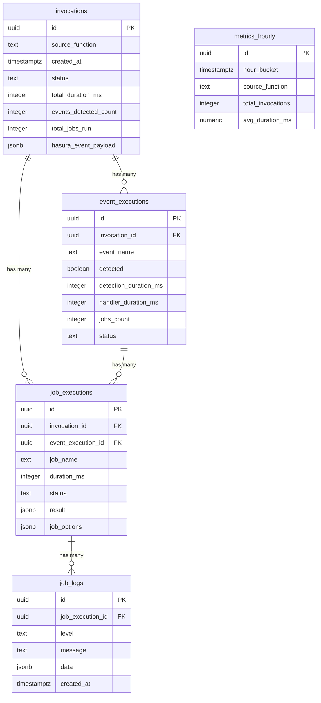
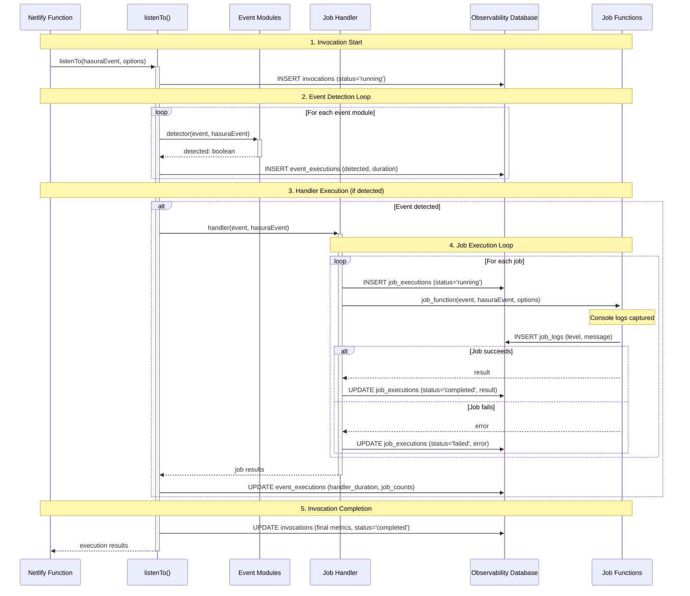
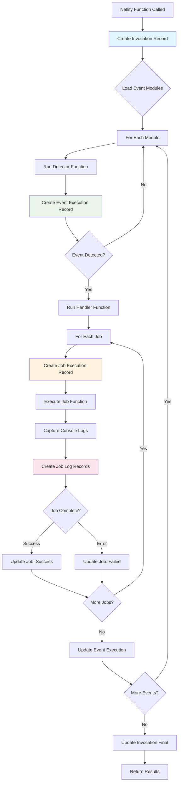
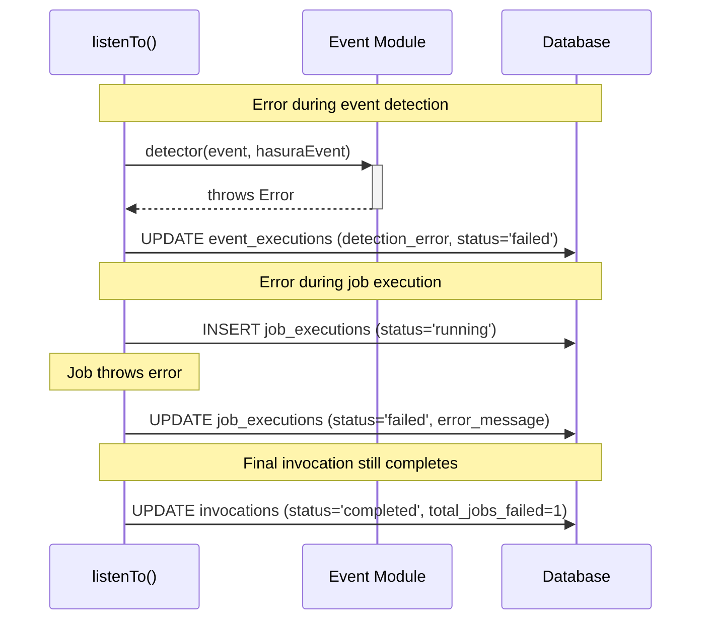

# Observability System Data Model

This document explains the data model, table relationships, and transaction flow for the Event Detector observability system.

## Table of Contents
- [Overview](#overview)
- [Database Schema](#database-schema)
- [Transaction Flow](#transaction-flow)
- [Visual Diagrams](#visual-diagrams)
- [Query Examples](#query-examples)

## Overview

The observability system uses a **dedicated PostgreSQL database** (`event_detector_observability`) on your existing RDS server and a hierarchical data model that mirrors the execution flow of your event detector:

```
📞 Function Call (Netlify, Lambda, etc.)
  ↓
🔄 Invocation (listenTo)
  ↓
🎯 Event Executions (detector modules)
  ↓
⚙️ Job Executions (async jobs)
  ↓
📝 Job Logs (console output)
```

## Database Schema

The observability data is stored in a dedicated database (`event_detector_observability`) rather than a schema within your main application database. This provides:
- **Isolation**: Observability operations don't impact main application performance
- **Scalability**: Independent connection pools and resource allocation
- **Security**: Granular access control for observability data
- **Maintenance**: Independent backup and maintenance schedules

### Entity Relationship Diagram



## Table Breakdown

### 1. `invocations` - The Root Transaction

**Purpose**: Captures each call to `listenTo()` - the main entry point of your event detector.

**Lifecycle**:
- **Created**: Immediately when `listenTo()` is called
- **Updated**: When execution completes with final metrics

**Key Fields**:
```sql
-- Core identification
id                      UUID PRIMARY KEY
source_function         TEXT NOT NULL  -- e.g., 'event-detector-moves'
source_system          TEXT           -- e.g., 'hasura', 'supabase', 'custom'
created_at             TIMESTAMPTZ

-- Source event context
source_event_payload    JSONB          -- Full event data from source system
source_user_email      TEXT           -- Who triggered the change
source_user_role       TEXT           -- User's role in source system

-- Execution results
status                 TEXT           -- 'running', 'completed', 'failed'
total_duration_ms      INTEGER        -- End-to-end execution time
events_detected_count  INTEGER        -- How many events were detected
total_jobs_run         INTEGER        -- Total jobs executed
total_jobs_succeeded   INTEGER        -- Successful jobs
total_jobs_failed      INTEGER        -- Failed jobs

-- Configuration
auto_load_modules      BOOLEAN        -- Was auto-loading enabled?
event_modules_directory TEXT          -- Path to events folder
context_data          JSONB          -- Custom context passed in
```

### 2. `event_executions` - Event Detection Results

**Purpose**: Records each event module that was checked during an invocation.

**Lifecycle**:
- **Created**: For every `.js` file in your `/events` directory
- **Updated**: After detection completes, and again after handler runs (if detected)

**Key Fields**:
```sql
-- Relationships
invocation_id          UUID FK to invocations
event_name            TEXT           -- e.g., 'move.pickup.successful'

-- Detection phase
detected              BOOLEAN        -- Was event triggered?
detection_duration_ms INTEGER        -- Time for detector function
detection_error       TEXT           -- Error during detection
status               TEXT           -- 'detecting', 'not_detected', 'handling', 'completed', 'failed'

-- Handler phase (if detected)
handler_duration_ms   INTEGER        -- Time for handler function
handler_error        TEXT           -- Error during handling
jobs_count           INTEGER        -- Jobs scheduled
jobs_succeeded       INTEGER        -- Jobs that completed successfully
jobs_failed          INTEGER        -- Jobs that failed
```

### 3. `job_executions` - Individual Job Results

**Purpose**: Captures each async job that runs when an event is detected.

**Lifecycle**:
- **Created**: For every job in the array passed to `run(event, hasuraEvent, jobs)`
- **Updated**: When job completes with final results

**Key Fields**:
```sql
-- Relationships
invocation_id         UUID FK to invocations
event_execution_id    UUID FK to event_executions

-- Job identification
job_name             TEXT           -- Function name (from func.name)
job_function_name    TEXT           -- Actual function name
job_options          JSONB          -- Parameters passed to job

-- Execution results
status               TEXT           -- 'running', 'completed', 'failed'
duration_ms          INTEGER        -- Job execution time
result               JSONB          -- Return value from job
error_message        TEXT           -- Error if job failed
error_stack          TEXT           -- Full error stack trace
console_logs         JSONB          -- Array of captured console output
```

### 4. `job_logs` - Console Output Capture

**Purpose**: Stores all console.log, console.error, etc. output from job functions.

**Lifecycle**:
- **Created**: Every time a job calls `console.log/error/warn/info` (if capture enabled)

**Key Fields**:
```sql
-- Relationship
job_execution_id      UUID FK to job_executions

-- Log data
level                TEXT           -- 'info', 'error', 'warn', 'debug'
message              TEXT           -- The actual log message
data                 JSONB          -- Additional structured data
source               TEXT           -- Where the log originated
created_at           TIMESTAMPTZ    -- When log was captured
```

### 5. `metrics_hourly` - Aggregated Performance Data

**Purpose**: Pre-computed hourly metrics for fast dashboard queries.

**Lifecycle**:
- **Created/Updated**: By background aggregation process (materialized view refresh)

## Transaction Flow

### Complete Sequence Diagram



### Detailed Transaction Flow Example

Let's trace through a complete example with your `move.pickup.successful` event:

#### Step 1: Invocation Starts
```javascript
// Function: event-detector-moves.js (could be Netlify, Lambda, etc.)
exports.handler = async (event, context) => {
  const res = await listenTo(JSON.parse(event.body), {
    sourceFunction: 'event-detector-moves',
    sourceSystem: 'hasura', // or 'supabase', 'custom', etc.
    observability: { enabled: true, ... }
  });
```

**Database Action**:
```sql
-- Creates root transaction record
INSERT INTO invocations (
  id, source_function, source_system, source_event_payload, source_user_email,
  status, created_at
) VALUES (
  '550e8400-e29b-41d4-a716-446655440000',
  'event-detector-moves',
  'hasura',
  '{"event": {"data": {"new": {"status": "pickup successful"}}}}',
  'driver@company.com',
  'running',
  NOW()
);
```

#### Step 2: Event Detection Loop
The system checks each `.js` file in your `/events` directory:

```javascript
// Checking: move.pickup.successful.js
module.exports.detector = async (event, sourceEvent) => {
  const { dbEvent, operation } = parseEvent(sourceEvent); // Generic parser
  const statusChanged = columnHasChanged('status', dbEvent);
  const isThisEvent = dbEvent?.new?.status === 'pickup successful';
  return statusChanged && isThisEvent; // Returns true - event detected!
};
```

**Database Actions**:
```sql
-- For each event module checked
INSERT INTO event_executions (
  id, invocation_id, event_name, detected, detection_duration_ms, status
) VALUES 
-- This one detected the event
('event-1', '550e8400...', 'move.pickup.successful', true, 15, 'handling'),
-- These didn't detect anything  
('event-2', '550e8400...', 'move.cancel.pending', false, 8, 'not_detected'),
('event-3', '550e8400...', 'user.status.change', false, 12, 'not_detected');
```

#### Step 3: Handler Execution
For detected events, the handler runs:

```javascript
module.exports.handler = async (event, sourceEvent) => {
  const { dbEvent } = parseEvent(sourceEvent); // Generic parser

  return await run(event, sourceEvent, [
    job(reapplySlaDuration, { move: dbEvent?.new, updateEarliestAvailableTime: false }),
    job(sendNotification, { moveId: dbEvent?.new?.id, type: 'pickup_complete' }),
    job(updateAnalytics, { event: 'pickup_successful', moveId: dbEvent?.new?.id })
  ]);
};
```

**Database Actions**:
```sql
-- Creates job execution records for each job
INSERT INTO job_executions (
  id, invocation_id, event_execution_id, job_name, job_options, status
) VALUES
('job-1', '550e8400...', 'event-1', 'reapplySlaDuration', '{"move": {...}}', 'running'),
('job-2', '550e8400...', 'event-1', 'sendNotification', '{"moveId": 123}', 'running'),
('job-3', '550e8400...', 'event-1', 'updateAnalytics', '{"event": "pickup_successful"}', 'running');
```

#### Step 4: Job Console Output Capture
As jobs execute, their console output is captured:

```javascript
const sendNotification = async (event, sourceEvent, options) => {
  console.log(`Sending pickup notification for move ${options.moveId}`);

  try {
    await notificationService.send({...});
    console.log('Notification sent successfully');
    return { sent: true, moveId: options.moveId };
  } catch (error) {
    console.error('Failed to send notification:', error.message);
    throw error;
  }
};
```

**Database Actions**:
```sql
-- Console logs captured in real-time
INSERT INTO job_logs (job_execution_id, level, message, created_at) VALUES
('job-2', 'info', 'Sending pickup notification for move 123', NOW()),
('job-2', 'info', 'Notification sent successfully', NOW());
```

#### Step 5: Job Completion
```sql
-- Job completes successfully
UPDATE job_executions SET 
  status = 'completed',
  duration_ms = 450,
  result = '{"sent": true, "moveId": 123}',
  updated_at = NOW()
WHERE id = 'job-2';
```

#### Step 6: Event Handler Completion
```sql
-- Handler completes with job summary
UPDATE event_executions SET
  handler_duration_ms = 1200,
  jobs_count = 3,
  jobs_succeeded = 3,
  jobs_failed = 0,
  status = 'completed',
  updated_at = NOW()
WHERE id = 'event-1';
```

#### Step 7: Invocation Completion
```sql
-- Final invocation update with complete metrics
UPDATE invocations SET
  total_duration_ms = 1800,
  events_detected_count = 1,
  total_jobs_run = 3,
  total_jobs_succeeded = 3,
  total_jobs_failed = 0,
  status = 'completed',
  updated_at = NOW()
WHERE id = '550e8400...';
```

## Data Flow Diagram



## Error Handling Flow



## Query Examples

### Dashboard Overview Query
```graphql
query DashboardOverview($timeRange: timestamptz!) {
  invocations(
    where: { created_at: { _gte: $timeRange } }
    order_by: { created_at: desc }
    limit: 10
  ) {
    id
    source_function
    created_at
    total_duration_ms
    success_rate
    
    event_executions {
      event_name
      detected
      job_executions {
        job_name
        status
        duration_ms
      }
    }
  }
}
```

### Performance Analysis Query
```sql
-- Find slowest jobs in last 24 hours
SELECT 
  je.job_name,
  AVG(je.duration_ms) as avg_duration,
  COUNT(*) as total_runs,
  COUNT(*) FILTER (WHERE je.status = 'failed') as failures,
  i.source_function
FROM job_executions je
JOIN invocations i ON je.invocation_id = i.id
WHERE je.created_at >= NOW() - INTERVAL '24 hours'
GROUP BY je.job_name, i.source_function
ORDER BY avg_duration DESC
LIMIT 10;
```

### Debug Specific Invocation
```sql
-- Get complete execution trace for debugging
SELECT 
  i.source_function,
  i.total_duration_ms,
  ee.event_name,
  ee.detected,
  je.job_name,
  je.status,
  je.duration_ms,
  je.error_message,
  jl.level,
  jl.message
FROM invocations i
LEFT JOIN event_executions ee ON i.id = ee.invocation_id
LEFT JOIN job_executions je ON ee.id = je.event_execution_id  
LEFT JOIN job_logs jl ON je.id = jl.job_execution_id
WHERE i.id = '550e8400-e29b-41d4-a716-446655440000'
ORDER BY ee.created_at, je.created_at, jl.created_at;
```

## Performance Considerations

### Write Performance
- **Buffered Writes**: Plugin batches database writes every 5 seconds
- **Connection Pooling**: Reuses database connections efficiently
- **Async Operations**: Database writes don't block event processing

### Query Performance
- **Indexes**: Optimized for common query patterns
- **Materialized Views**: Pre-computed metrics for dashboard speed
- **Partitioning**: Consider partitioning by date for high-volume systems

### Storage Estimates
- **Invocation**: ~2KB per invocation
- **Event Execution**: ~1KB per event checked
- **Job Execution**: ~3KB per job (including options/results)
- **Job Logs**: ~0.5KB per log line

**Example**: An invocation that checks 5 events, detects 2, runs 8 jobs with 20 log lines:
- Storage: ~2KB + 5×1KB + 8×3KB + 20×0.5KB = **37KB total**

This data model provides complete observability while maintaining reasonable storage requirements and query performance.

## Database Setup

To implement this model:
1. **Create Database**: Run `create-database.sql` to create the dedicated observability database
2. **Create Schema**: Run `schema.sql` to create tables, indexes, and functions
3. **Configure Connection**: Use `connection-config.js` for environment-specific database connections
4. **Setup Guide**: Follow `setup-guide.md` for complete implementation instructions

The separate database approach ensures observability operations don't impact your main application performance and provides better resource isolation.