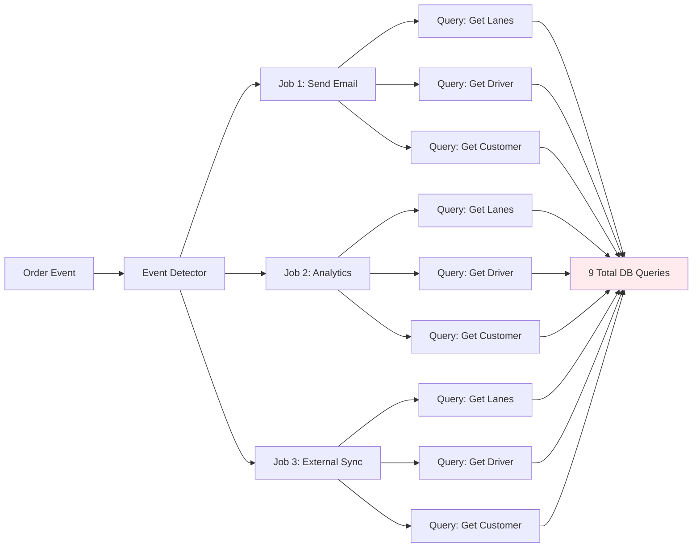
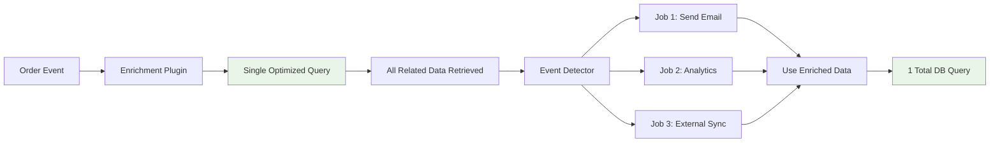

# Order Enrichment Plugin

A powerful data enrichment plugin that automatically fetches related records and enriches Hasura event payloads to prevent N+1 database queries in event detectors and jobs.

## Overview

The OrderEnrichmentPlugin demonstrates how to enrich Hasura event payloads with related database records during the `onPreConfigure` phase. This ensures that all subsequent event detectors and jobs have access to enriched data without needing to make additional database queries, significantly improving performance.

## Features

- **Automatic Data Enrichment**: Fetches related records based on foreign key relationships
- **N+1 Query Prevention**: Eliminates redundant database queries in jobs
- **Configurable Tables**: Specify which tables should be enriched
- **Performance Optimized**: Built-in caching and query limits
- **Database Connection Pooling**: Efficient database connections
- **Error Handling**: Graceful handling of enrichment failures
- **Memory Efficient**: Configurable limits on related record fetching

## Configuration

```typescript
import { OrderEnrichmentPlugin } from './example-plugins/order-enrichment/plugin.js';

const orderEnrichment = new OrderEnrichmentPlugin({
  enabled: true,

  // Database connection for enrichment queries
  database: {
    host: 'localhost',
    port: 5432,
    database: 'your_database',
    user: 'username',
    password: 'password'
  },

  // Tables that should be enriched with related data
  enrichTables: ['orders', 'shipments', 'bookings'],

  // Maximum number of related records to fetch per relationship
  maxRelatedRecords: 50,

  // Cache TTL for enrichment data (seconds)
  cacheTtl: 300  // 5 minutes
});
```

## Usage

```typescript
import { pluginManager } from '@/plugin.js';
import { OrderEnrichmentPlugin } from './example-plugins/order-enrichment/plugin.js';

// Register the plugin
const orderEnrichment = new OrderEnrichmentPlugin({
  enrichTables: ['orders', 'shipments'],
  maxRelatedRecords: 25
});

pluginManager.register(orderEnrichment);

// Initialize the plugin system
await pluginManager.initialize();

// Now events will have enriched data available in jobs
```

## Enrichment Examples

### Order Event Enrichment
When an `orders` table event occurs, the plugin automatically enriches it with:

**Original Event Payload**:
```json
{
  "event": {
    "data": {
      "new": {
        "id": 123,
        "customer_id": 456,
        "status": "confirmed",
        "total": 99.99
      }
    }
  }
}
```

**Enriched Event Payload**:
```json
{
  "event": {
    "data": {
      "new": {
        "id": 123,
        "customer_id": 456,
        "status": "confirmed",
        "total": 99.99,
        "_enriched": {
          "customer": {
            "id": 456,
            "name": "John Doe",
            "email": "john@example.com"
          },
          "order_items": [
            {"id": 1, "product_id": 101, "quantity": 2},
            {"id": 2, "product_id": 102, "quantity": 1}
          ],
          "shipping_address": {
            "id": 789,
            "street": "123 Main St",
            "city": "Anytown"
          }
        }
      }
    }
  }
}
```

## Enrichment Strategies

### 1. Foreign Key Relationships
Automatically detects and follows foreign key relationships:
```typescript
// For orders table, automatically enriches:
// - customer (via customer_id)
// - shipping_address (via shipping_address_id)
// - billing_address (via billing_address_id)
```

### 2. Reverse Relationships
Fetches related records that reference the current record:
```typescript
// For orders table, fetches:
// - order_items (where order_id = orders.id)
// - shipments (where order_id = orders.id)
// - payments (where order_id = orders.id)
```

### 3. Custom Relationships
Configure custom enrichment queries for complex relationships:
```typescript
const orderEnrichment = new OrderEnrichmentPlugin({
  customEnrichments: {
    orders: [
      {
        key: 'recent_orders',
        query: 'SELECT * FROM orders WHERE customer_id = $1 AND created_at > NOW() - INTERVAL \'30 days\' LIMIT 5',
        params: ['customer_id']
      }
    ]
  }
});
```

## Configuration Options

| Option | Type | Default | Description |
|--------|------|---------|-------------|
| `enabled` | `boolean` | `true` | Enable/disable the plugin |
| `database` | `DatabaseConfig` | `undefined` | Database connection configuration |
| `enrichTables` | `string[]` | `['orders', 'shipments', 'bookings']` | Tables to enrich |
| `maxRelatedRecords` | `number` | `50` | Max related records per relationship |
| `cacheTtl` | `number` | `300` | Cache TTL in seconds |

## Data Enrichment Flow Architecture

The following diagram illustrates how payload enrichment works in the plugin system to prevent N+1 database queries:

```mermaid
flowchart TD
    A[Hasura Event Trigger] --> B[Raw Hasura Payload]
    B --> C{listenTo() Called}

    C --> D[Plugin Manager: onPreConfigure Hook]
    D --> E{Enrichment Plugin Registered?}

    E -->|No| F[Skip Enrichment]
    E -->|Yes| G[Check Table Name]

    G --> H{Table Needs Enrichment?}
    H -->|No| F
    H -->|Yes| I[Extract Record ID]

    I --> J{Record ID Found?}
    J -->|No| F
    J -->|Yes| K[Single Optimized DB Query]

    K --> L[Fetch Related Records]
    L --> M[Orders JOIN Lanes JOIN Drivers JOIN Vehicles JOIN Customers]

    M --> N[Related Data Retrieved]
    N --> O[Modify hasuraEvent by Reference]

    O --> P[Inject Related Records]
    P --> Q[hasuraEvent.event.data.new.lanes = relatedData.lanes]
    Q --> R[hasuraEvent.event.data.new.driver = relatedData.driver]
    R --> S[hasuraEvent.event.data.new.vehicle = relatedData.vehicle]
    S --> T[hasuraEvent.event.data.new.customer = relatedData.customer]

    T --> U[Add Enrichment Metadata]
    U --> V[hasuraEvent.event.data.new.__enriched]

    V --> W[Extract Correlation ID]
    W --> X{Correlation ID Found?}
    X -->|Yes| Y[Return options with correlationId]
    X -->|No| Z[Return original options]

    F --> Z
    Y --> AA[Enriched Payload + Correlation ID]
    Z --> BB[Original Payload + Options]

    AA --> CC[Event Detection Phase]
    BB --> CC

    CC --> DD[Event Detectors Run]
    DD --> EE{Event Detected?}

    EE -->|No| FF[No Jobs Execute]
    EE -->|Yes| GG[Jobs Execute with Enriched Data]

    GG --> HH[Job 1: Send Notification]
    GG --> II[Job 2: Update Analytics]
    GG --> JJ[Job 3: Sync External System]

    HH --> KK[Access Enriched Data Directly]
    II --> KK
    JJ --> KK

    KK --> LL[No Additional DB Queries Needed]
    LL --> MM[All Related Data Already Present]

    MM --> NN[Job Results]
    NN --> OO[Final Response]

    classDef enrichment fill:#e1f5fe
    classDef database fill:#fff3e0
    classDef payload fill:#f3e5f5
    classDef jobs fill:#e8f5e8

    class K,L,M,N database
    class O,P,Q,R,S,T,U,V enrichment
    class B,AA,BB payload
    class HH,II,JJ,KK,LL,MM jobs
```

### Before vs After Enrichment Comparison

#### Without Enrichment (N+1 Problem)


#### With Enrichment (Optimized)


### Query Performance Optimization

The enrichment plugin uses a single optimized PostgreSQL query to fetch all related data:

```sql
-- Single query replaces multiple N+1 queries
SELECT
    o.*,
    json_agg(DISTINCT jsonb_build_object(
        'id', l.id,
        'pickup_location', l.pickup_location,
        'delivery_location', l.delivery_location,
        'distance_miles', l.distance_miles,
        'status', l.status
    )) FILTER (WHERE l.id IS NOT NULL) as lanes,

    row_to_json(d.*) as driver,
    row_to_json(v.*) as vehicle,
    row_to_json(c.*) as customer

FROM orders o
LEFT JOIN lanes l ON l.order_id = o.id
LEFT JOIN drivers d ON d.id = o.driver_id
LEFT JOIN vehicles v ON v.id = o.vehicle_id
LEFT JOIN customers c ON c.id = o.customer_id
WHERE o.id = $1
GROUP BY o.id, d.id, v.id, c.id;
```

## Performance Benefits

### Query Reduction
- **Before**: 1 + (N × M) queries where N = jobs, M = related tables
- **After**: 1 query total
- **Example**: 3 jobs × 3 related tables = 9 queries → 1 query (89% reduction)

### Memory Efficiency
- Related data loaded once and shared across all jobs
- No duplicate data fetching or caching needed

### Response Time
- Single database round-trip vs multiple sequential queries
- Reduced connection overhead and network latency

### Before Enrichment
```typescript
// Event handler makes multiple queries
export const handler = async (eventName, hasuraEvent) => {
  const order = hasuraEvent.event.data.new;

  // N+1 query problem:
  const customer = await db.query('SELECT * FROM customers WHERE id = $1', [order.customer_id]);
  const items = await db.query('SELECT * FROM order_items WHERE order_id = $1', [order.id]);
  const address = await db.query('SELECT * FROM addresses WHERE id = $1', [order.shipping_address_id]);

  // Process with enriched data...
};
```

### After Enrichment
```typescript
// Event handler uses pre-enriched data
export const handler = async (eventName, hasuraEvent) => {
  const order = hasuraEvent.event.data.new;

  // No additional queries needed:
  const customer = order._enriched.customer;
  const items = order._enriched.order_items;
  const address = order._enriched.shipping_address;

  // Process with enriched data...
};
```

## Advanced Usage

### Custom Enrichment Logic
```typescript
class CustomOrderEnrichmentPlugin extends OrderEnrichmentPlugin {
  async enrichOrder(order) {
    // Custom enrichment logic
    const enriched = await super.enrichOrder(order);

    // Add custom calculated fields
    enriched.total_items = enriched.order_items?.length || 0;
    enriched.is_premium_customer = enriched.customer?.tier === 'premium';

    return enriched;
  }
}
```

### Conditional Enrichment
```typescript
const orderEnrichment = new OrderEnrichmentPlugin({
  shouldEnrich: (tableName, operation) => {
    // Only enrich INSERT and UPDATE operations for orders
    return tableName === 'orders' && ['INSERT', 'UPDATE'].includes(operation);
  }
});
```

## Use Cases

- **Order Processing**: Enrich order events with customer, items, and address data
- **Notification Systems**: Pre-load user preferences and contact information
- **Analytics**: Gather related data for comprehensive event analysis
- **Workflow Automation**: Provide complete context for business rule processing
- **API Responses**: Build rich responses without additional queries

## Best Practices

1. **Selective Enrichment**: Only enrich tables that benefit from related data
2. **Limit Related Records**: Set reasonable `maxRelatedRecords` to control memory usage
3. **Use Caching**: Enable caching for frequently accessed related data
4. **Monitor Performance**: Track enrichment query performance and adjust limits
5. **Error Handling**: Ensure jobs can handle cases where enrichment fails

## Troubleshooting

### Common Issues

**Enrichment not working**:
- Verify database connection configuration
- Check that table names are in `enrichTables` array
- Ensure foreign key relationships exist

**Performance issues**:
- Reduce `maxRelatedRecords` limit
- Increase `cacheTtl` for stable data
- Review which tables really need enrichment

**Memory usage high**:
- Lower `maxRelatedRecords`
- Reduce number of tables in `enrichTables`
- Implement custom enrichment with specific field selection