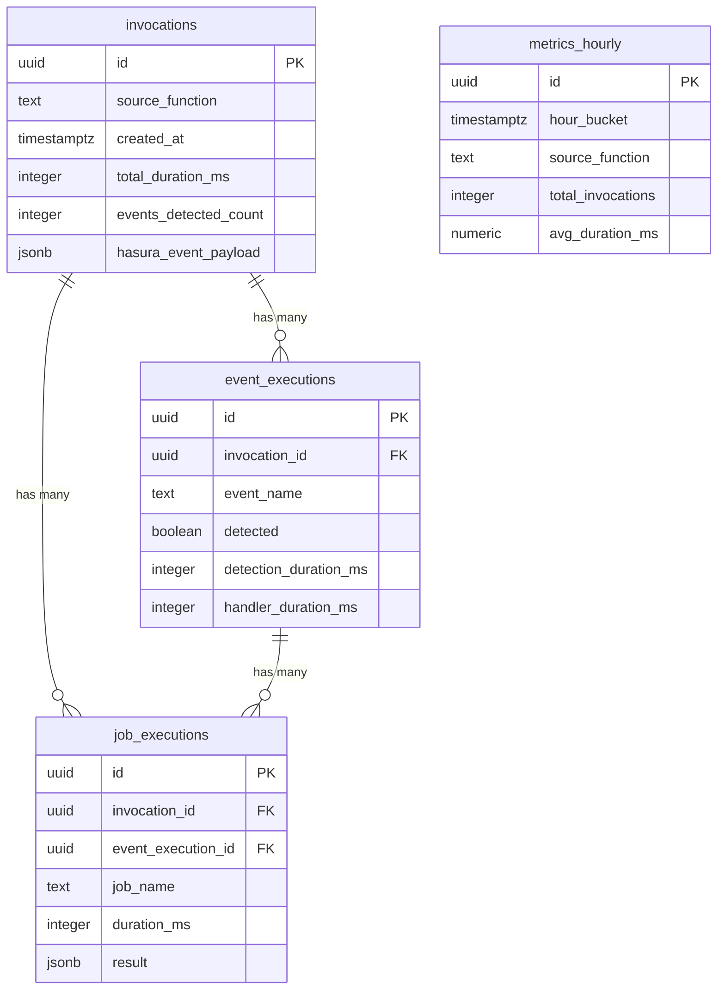

# Observability Database Setup Guide

This guide walks you through setting up a dedicated PostgreSQL database for Event Detector observability on the same RDS server as your main application.

## Overview

The observability system uses a **separate database** on your existing RDS PostgreSQL server to:
- Isolate observability data from your main application data
- Provide dedicated connection pools and performance tuning
- Enable independent backup and maintenance schedules
- Allow granular access control for observability data

## Prerequisites

- Existing PostgreSQL RDS server (where your main database runs)
- Master user access to the PostgreSQL server (the username you used when creating RDS)
- Database client: `psql`, pgAdmin, DBeaver, or similar PostgreSQL client

## Setup Process

The setup is now split into **three clear steps** to work with any PostgreSQL client (pgAdmin, DBeaver, psql, etc.):

### Step 1: Create the Observability Database

Connect to your RDS server as your **master user** (the username you used when creating the RDS instance) and run the database creation script.

#### Using psql:
```bash
psql -h your-rds-endpoint.region.rds.amazonaws.com -U your_master_user -f create-database.sql
```

#### Using GUI clients (pgAdmin, DBeaver, etc.):
1. Connect to any existing database on your RDS server
2. Open `create-database.sql` in the SQL editor
3. Execute the script

This script will:
- Create the `event_detector_observability` database
- Create three dedicated users:
  - `observability_admin` - Full database management access
  - `observability_app` - Read/write access for the plugin
  - `observability_readonly` - Read-only access for dashboards/reports

### Step 2: Set Up Database Permissions

**Important**: Now connect specifically to the **new** `event_detector_observability` database and run the permissions setup:

#### Using psql:
```bash
psql -h your-rds-endpoint.region.rds.amazonaws.com \
     -U observability_admin \
     -d event_detector_observability \
     -f setup-permissions.sql
```

#### Using GUI clients:
1. **Connect to the `event_detector_observability` database** (not your original database)
2. Login as `observability_admin` user
3. Open `setup-permissions.sql` in the SQL editor
4. Execute the script

This script will:
- Set up schema permissions for all three users
- Configure default privileges for future objects
- Create diagnostic views for troubleshooting

### Step 3: Create Tables and Indexes

Still connected to the `event_detector_observability` database, create the schema:

#### Using psql:
```bash
psql -h your-rds-endpoint.region.rds.amazonaws.com \
     -U observability_admin \
     -d event_detector_observability \
     -f schema.sql
```

#### Using GUI clients:
1. Ensure you're connected to `event_detector_observability` database as `observability_admin`
2. Open `schema.sql` in the SQL editor
3. Execute the script

This creates:
- Core tables: `invocations`, `event_executions`, `job_executions`, `metrics_hourly`
- Performance indexes for fast queries
- Computed functions for success rates and averages
- Materialized views for dashboard performance

**⚠️ IMPORTANT**: Change the default passwords before production use!

## Configure Environment Variables

Add these environment variables to your Netlify function or application:

```bash
# Observability Database Configuration
OBSERVABILITY_DB_HOST=your-rds-endpoint.region.rds.amazonaws.com
OBSERVABILITY_DB_PORT=5432
OBSERVABILITY_DB_NAME=event_detector_observability
OBSERVABILITY_DB_USER=observability_app
OBSERVABILITY_DB_PASSWORD=your-secure-password-here

# Optional: Connection tuning
OBSERVABILITY_DB_POOL_MIN=2
OBSERVABILITY_DB_POOL_MAX=10
OBSERVABILITY_DB_POOL_IDLE=10000
```

## Update Your Event Detector Configuration

Update your `listenTo()` calls to use the observability database:

```javascript
const { getConfig } = require('./path/to/connection-config');

const result = await listenTo(hasuraEvent, {
  sourceFunction: 'your-function-name',
  observability: {
    enabled: true,
    database: {
      // Use the connection configuration
      ...getConfig(),

      // Or provide connection details directly
      host: process.env.OBSERVABILITY_DB_HOST,
      port: process.env.OBSERVABILITY_DB_PORT,
      database: process.env.OBSERVABILITY_DB_NAME,
      username: process.env.OBSERVABILITY_DB_USER,
      password: process.env.OBSERVABILITY_DB_PASSWORD
    },

    // Other observability options
    bufferSize: 100,
    flushInterval: 5000,
    captureConsole: true
  }
});
```

## Database Schema Overview

The observability database contains four main tables:



## User Roles and Permissions

### `observability_admin`
- **Purpose**: Database administration and schema changes
- **Permissions**: Full database access, can create/modify tables and functions
- **Usage**: Running setup scripts, schema updates, maintenance

### `observability_app`
- **Purpose**: Application-level database operations
- **Permissions**: Read/write access to all tables and sequences
- **Usage**: Event detector plugin writes observability data

### `observability_readonly`
- **Purpose**: Dashboard and reporting access
- **Permissions**: Read-only access to all tables and views
- **Usage**: Grafana, custom dashboards, data analysis

## Connection Configuration

The `connection-config.js` module provides:
- Environment-specific connection settings
- Connection pool optimization for observability workloads
- SSL configuration for production environments
- Connection validation and error handling

Example usage:

```javascript
const { getConfig, createConnectionUrl } = require('./connection-config');

// Get environment-specific configuration
const config = getConfig('production');

// Create connection URL for tools that need it
const connectionUrl = createConnectionUrl(config);

// Validate configuration before use
validateConfig(config);
```

## Performance Considerations

### Connection Pooling
- **Development**: 1-5 connections
- **Staging**: 2-8 connections
- **Production**: 3-15 connections

### Write Performance
- Buffered writes (default: every 5 seconds)
- Bulk insert operations for better throughput
- Non-blocking writes don't slow down event processing

### Query Performance
- Optimized indexes for common query patterns
- Materialized views for dashboard metrics
- Correlation ID indexes for tracing event chains

## Monitoring and Maintenance

### Regular Tasks

1. **Monitor Connection Usage**:
   ```sql
   SELECT state, count(*)
   FROM pg_stat_activity
   WHERE datname = 'hasura_event_detector_observability'
   GROUP BY state;
   ```

2. **Refresh Materialized Views**:
   ```sql
   SELECT refresh_dashboard_stats();
   ```

3. **Check Storage Usage**:
   ```sql
   SELECT pg_database_size('hasura_event_detector_observability') / 1024 / 1024 AS size_mb;
   ```

### Data Retention

Consider implementing data retention policies based on your needs:

```sql
-- Example: Delete invocation data older than 30 days
DELETE FROM invocations
WHERE created_at < NOW() - INTERVAL '30 days';

-- Archive old data to separate tables if needed
CREATE TABLE invocations_archive AS
SELECT * FROM invocations
WHERE created_at < NOW() - INTERVAL '90 days';
```

## Troubleshooting

### Common Issues

1. **"role postgres does not exist" Error**
   - Use your RDS master username instead of 'postgres'
   - This is the username you specified when creating your RDS instance

2. **"syntax error at or near \\" Error**
   - Use the new split scripts: create-database.sql, then setup-permissions.sql
   - Avoid using psql meta-commands in GUI clients

3. **Connection Refused**
   - Check that RDS security groups allow connections
   - Verify host and port settings
   - Ensure user has `CONNECT` privilege on the database

4. **Permission Denied**
   - Run setup-permissions.sql as observability_admin user
   - Verify password is correct and user exists
   - Ensure you're connected to the event_detector_observability database

5. **High Connection Usage**
   - Monitor `pg_stat_activity` for connection counts
   - Adjust connection pool settings
   - Consider read replicas for heavy dashboard usage

### Diagnostic Queries

```sql
-- Check current connections
SELECT datname, usename, state, count(*)
FROM pg_stat_activity
GROUP BY datname, usename, state;

-- Check table sizes
SELECT
    schemaname,
    tablename,
    pg_total_relation_size(schemaname||'.'||tablename) / 1024 / 1024 AS size_mb
FROM pg_tables
WHERE schemaname = 'public'
ORDER BY size_mb DESC;

-- Check recent activity by source system
SELECT source_system, source_function, count(*), max(created_at) as latest
FROM invocations
WHERE created_at >= NOW() - INTERVAL '1 hour'
GROUP BY source_system, source_function;
```

## Security Best Practices

1. **Change Default Passwords**: Update all user passwords before production
2. **Use SSL**: Enable SSL for production connections
3. **Principle of Least Privilege**: Use `observability_app` user for plugin, not admin
4. **Network Security**: Restrict database access to authorized IPs only
5. **Regular Updates**: Keep PostgreSQL version updated
6. **Monitor Access**: Review connection logs periodically

## Next Steps

After completing the setup:

1. **Test the Connection**: Verify your plugin can write to the database
2. **Set Up Dashboards**: Connect Grafana or custom dashboards to the readonly user
3. **Configure Monitoring**: Set up alerts for connection issues or storage growth
4. **Plan Maintenance**: Schedule regular cleanup and materialized view refreshes
5. **Document Access**: Share readonly credentials with team members who need dashboard access

The observability database is now ready to capture detailed execution metadata from your Event Detector system, regardless of the event source (Hasura, Supabase, custom webhooks, etc.)!